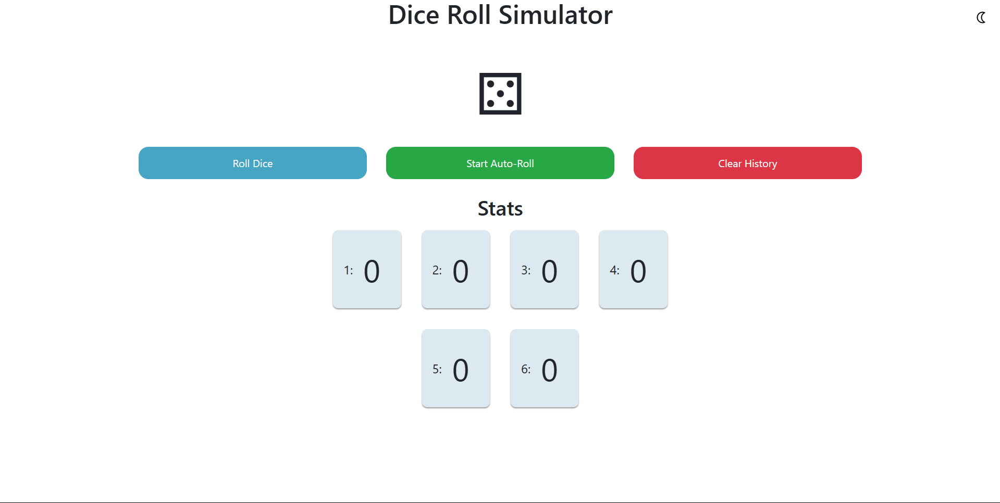

# Dice Roll Simulator

An interactive and animated Dice Roll Simulator built using **HTML**, **CSS**, and **JavaScript**. Click the **Roll Dice** button to simulate a dice roll, view realistic dice faces, and keep track of roll history, statistics, and more!

---

## Preview



---

## Objective

This project showcases a fully interactive dice simulator that includes animation, auto-roll functionality, light/dark theming, and statistics. It's a great exercise in DOM manipulation, animations, and event-driven logic.

---

## Features

### Dice UI
- Centered and styled dice face using Unicode icons
- Realistic dice face appearance
- Smooth roll animation using CSS `@keyframes`

### Roll Button
- Clickable **Roll Dice** button
- Triggers an animated roll and displays the result

### Roll History
- Displays list of all previous rolls
- Latest roll appears on top
- Each entry shows the roll number and dice face

### Statistics
- Shows how many times each number (1-6) has been rolled
- Updates live with each roll

### Auto-Roll Mode
- Toggles automatic dice rolls every 2 seconds
- Start/Stop functionality included

### Clear History
- Button to clear all roll history and statistics

### Theme Switcher
- Toggle between **Light** and **Dark** mode
- Smooth background and text transitions

---

## 🗂 Folder Structure

```
dice-roll-simulator/
│
├── index.html # Main HTML structure
├── style.css # Styling: layout, animations, themes
├── script.js # Dice roll logic, DOM manipulation, animation
```
